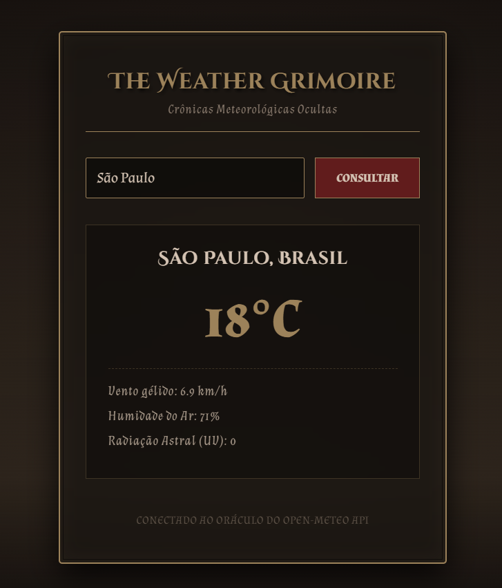

# 🏛️ The Weather Grimoire

O **The Weather Grimoire** é um web app minimalista e místico para consulta meteorológica em tempo real, profundamente inspirado na estética **Dark Academia / Gótico Vintage**. O projeto combina uma interface nostalgia e translúcida (Glassmorphism) com dados meteorológicos traduzidos como segredos arcanos.

---

## 🔮 Funcionalidades

- **Invocação por Cidade:** Digite o nome de qualquer localidade do mundo para revelar suas condições climáticas instantaneamente.
- **Almanaque Expandido:** Além da temperatura principal arredondada, o grimório revela dados profundos como a velocidade do vento gélido, a umidade do ar e o índice de Radiação Astral (UV).
- **Efeito Glassmorphism:** O card principal utiliza a propriedade `backdrop-filter: blur()` para gerar uma textura de vidro fosco enevoado, destacando-se imponentemente sobre o plano de fundo radial à luz de velas.
- **Tipografia Temática:** Uso das fontes *Cinzel Decorative* e *Almendra* importadas do Google Fonts, aplicando estilizações em `UPPERCASE` para dar um ar literário e editorial ao cabeçalho e ao nome da cidade.

---

## 📸 Demonstração

<div align="center">
  
</div>

---

## 🛠️ Tecnologias Utilizadas

O projeto foi construído puramente com a tríade fundamental do desenvolvimento web, sem a necessidade de frameworks pesados, focando em performance e modularidade:

- **HTML5:** Estrutura semântica das seções, componentes e camadas visuais.
- **CSS3:** Layout Moderno (Flexbox), Variáveis CSS (Custom Properties) para paleta de cores escuras, efeitos de vidro fosco (`backdrop-filter`) e animações nativas otimizadas (`@keyframes`).
- **JavaScript (ES6+):** Consumo assíncrono unificado de APIs (`Async/Await` e `Fetch`), manipulação dinâmica do DOM e arquitetura modular (**ES Modules** separando a lógica de tela da lógica de requisições).
- **API Open-Meteo:** Utilizada tanto para a geocodificação (conversão de nome em coordenadas) quanto para buscar as métricas climáticas atuais no formato unificado mais moderno da API.

---

## 📁 Estrutura do Projeto

```text
the-weather-grimoire/
├── index.html              # Estrutura principal e camadas do grimório
├── assets/
│   ├── css/
│   │   └── style.css       # Estilizações góticas, variáveis e animação da chuva
│   └── js/
│       ├── api.js          # Funções de conexões assíncronas com a API (Geocoding e Weather)
│       └── main.js         # Controle de eventos da tela e manipulação do DOM
└── README.md               # Documentação do projeto
```
## 🧠 Aprendizados Adquiridos

Durante o desenvolvimento do The Weather Grimoire, foi possível consolidar conceitos fundamentais de engenharia de software frontend:

- **Tratamento de respostas assíncronas em cadeia:** Lógica para buscar primeiro as coordenadas de uma localização específica para, em seguida, disparar a consulta dos dados climáticos.
- **Refatoração e Consumo de APIs Modernas:** Transição de parâmetros legados do Open-Meteo para o formato unificado `current`, eliminando conflitos de dados em requisições assíncronas e blindando o código contra propriedades nulas (`undefined`).
- **Arquitetura modular moderna:** Uso prático de `import` e `export` nativos (ES Modules) para isolar completamente as responsabilidades entre a lógica de comunicação com o servidor e o controle do DOM.
- **Experiência do Usuário (UX) Temática:** Adaptação de dados brutos de APIs meteorológicas para uma interface lúdica e imersiva sem perder o rigor técnico do projeto.

---

Feito por Roberta Rodrigues.
